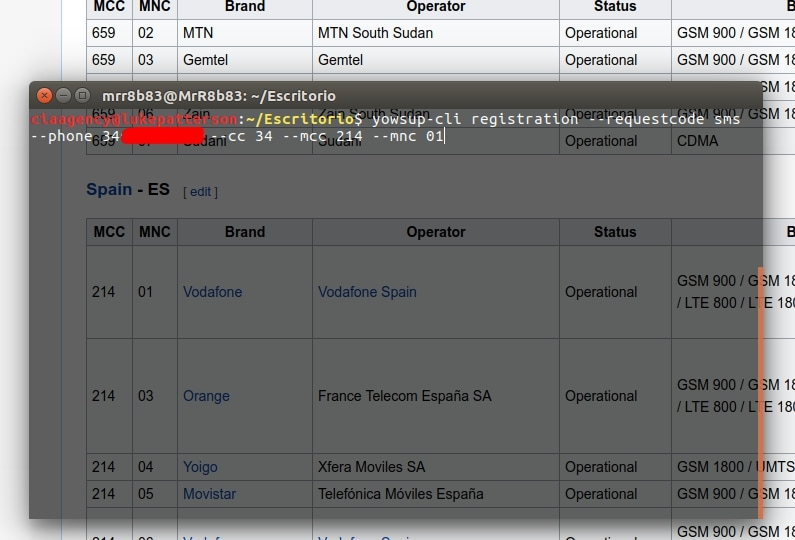
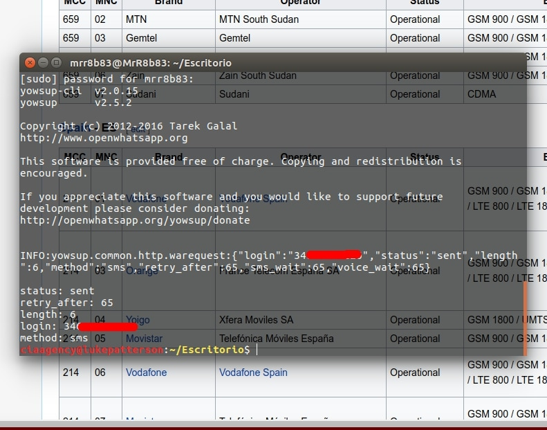
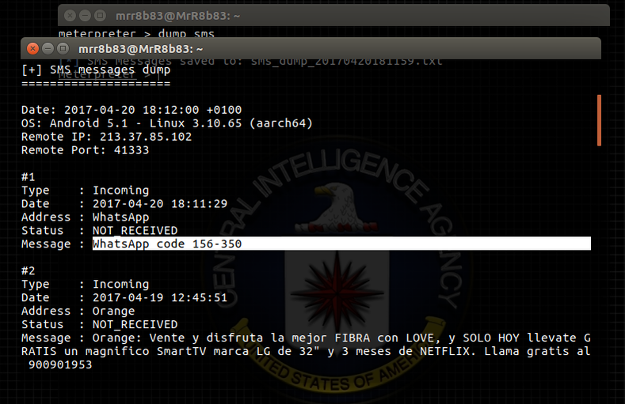
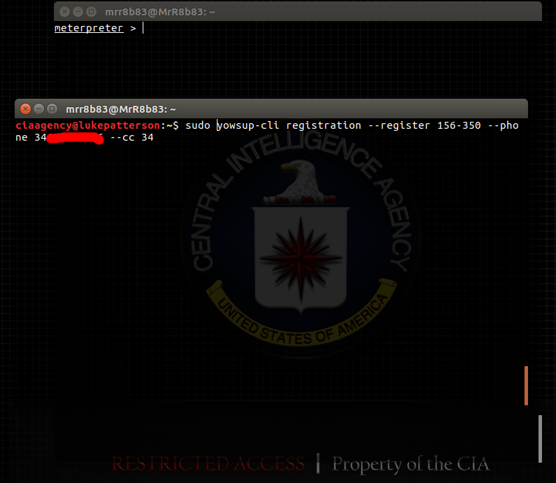
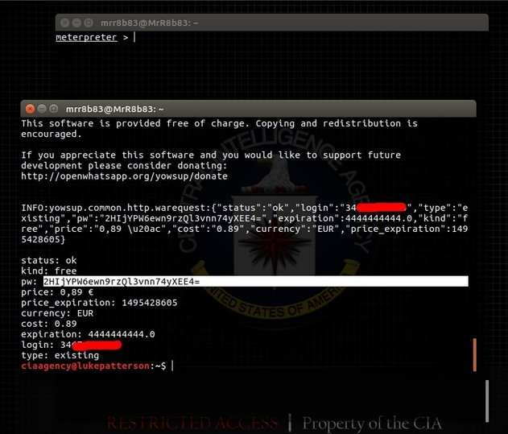
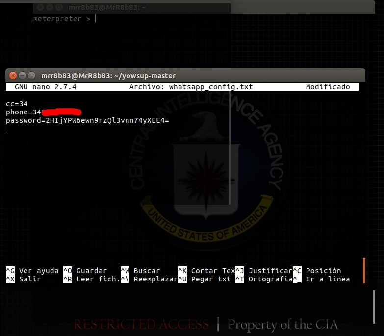
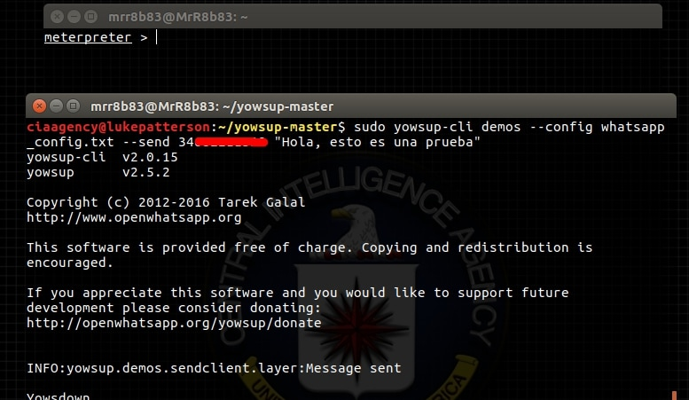
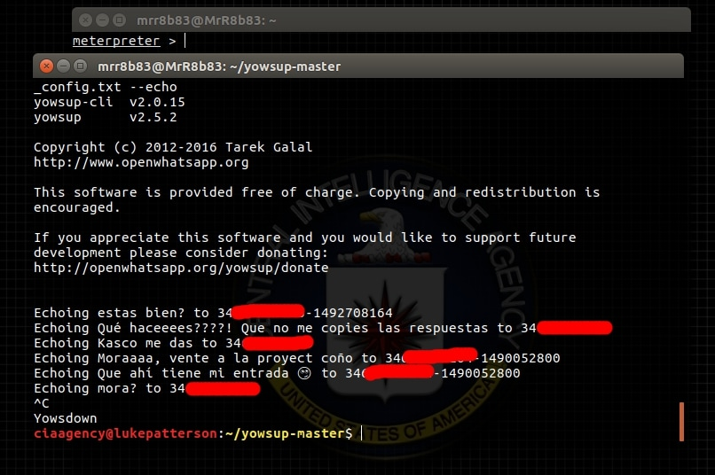

Program made for after having made a backdoor attack make an intrusion into the WhatsApp of the victim. These types of attacks occur at night, while the victim sleeps, because he loses his WhatsApp session. BackDoors can be hidden in applications, audios, music and even in simple images sent by WhatsApp. I explain on my page all procedures for the generation of BackDoor's.

In isolation from the program... the operation is the same. What I've tried is to automate the procedure so it's less complex.

First we send an sms from WhatsApp Central for registration code

The above command will send the sms registration code to the victim's mobile phone

Thanks to metasploit with the session created on the infected device, we are able to see the sms's received using <b>dump_sms</b>

And then we can enter the registration code using <b>yowsup</b>

It will generate a password. It is important to remember it and write it down... but RemoteWA automatically generate the file whatsapp_config.txt with everything you need inside it

This is <b>whatsapp_config.txt</b> file

Now from the generated file, we can make the mobile victim to send a message by whatsapp to whomever we want. In this case I have infected a cell phone, and I have sent a message to me from his phone. The following would happen:

And now, as we can see, I got a whatsapp from his phone number

Another thing we can do is also sniff the conversations that are taking place in WhatsApp from his phone number

If you have any doubts, you can visit my web page where I explain the procedure in more detail -> <b>www.mundohackers.es</b>

